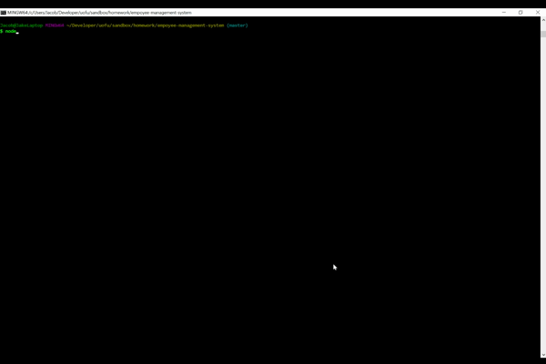
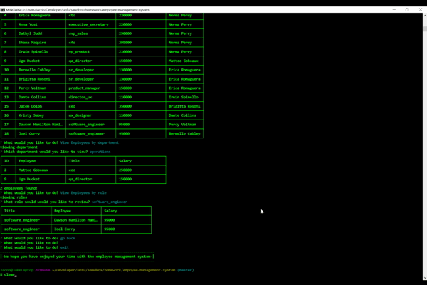

# Employee Management System
​
## Overview
​
This application allows the user to create, view and update employee information at a basic level involving their name, title, salary, department, and manager.
​
### Gallery
Here you can see the different functions of the application being used.
The user may add a department, a role, or an employee.​ 

* Add Function
,
​
* View Function
,

* Update Function
,
​
​
### Problem
​
A company wants to be able to manage their staff information, view and update the employee roster as the company grows.

​
### Solution
​
I will create a command line application that will allow the user add departments, roles and their salaries, and employees.
It will also allow the user to view all employees, employees by department, or employees by role, displayed nicely in a table.
If an employees role changes, the user may update the role, the manager and department of the employee.
​
## Tech and Features Used
​
* Javascript
* MySQL
* Node.js
* Node Librarys:
Inquirer - CLI table3 - mysql

​
## How to use
​
* Clone this repo
* Navigate to the folder this was cloned to and run npm i.
* run 'node app.js' in the command line
* Navigate using the up and down keys on the keyboard to select the options.
* Choose an option that describes what you want to do and follow the instructions.
* Adding a department just requires you to enter the name of the department.
* Adding a role requires you to add a salary and choose a department to place it in.
* Adding an employee requires you to add the name of the employee, what role they will be assuming, and who their manager will be.
* Viewing all employees will list out the employees by employee number, will display their title, department, salary, and manager name.
* View by department will list the employees name, title and salary of the employees under that department.
* Viewing employee by role will list the employees who hold the title of the role you choose.
* updating the emplyee role will require you to choose the new role, and the manager of that new role.
​
## Technical Overview
​
1. the key component of this app is mysql.
2. connecting to mysql
3. and using inquirer to come up with mysql querys

### Future additions

There are a few things I will do to refactor this code:
* I will be creating query functions in other js files to clean up the code and export it to the main js file.

